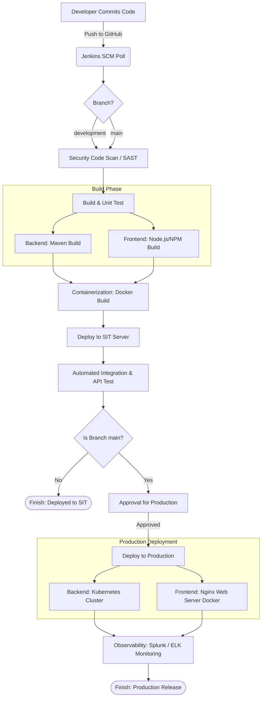

# Project Overview

Welcome to the project repository! This repository contains the source code, CI/CD pipeline definitions, and Kubernetes deployment configurations for our enterprise application.

## Repository Structure

- `src/` - Core Java source code for the application.
- `digital-channel-app/` - Application module/components.
- `k8s/` - Kubernetes deployment manifests.
- `Dockerfile` - Instructions for containerizing the application.
- `Jenkinsfile` - CI/CD pipeline configuration.
- `pom.xml` - Maven project configuration and dependencies.

## Branching Strategy & CI/CD Pipeline Differences

This project utilizes the following primary branches for development and deployment. Masing-masing branch memiliki perbedaan pada alur pipelinenya:

*   **`development`**: The active development branch. Semua fitur baru dan *bug fixes* diintegrasikan ke branch ini untuk diuji.
    *   **Pipeline behavior**: Pada branch ini, pipeline hanya akan berjalan sampai dengan pengiriman ke server **SIT (System Integration Testing)** dan **Automated API Test**. Pipeline tidak akan melaju ke tahap deployment *Production*.
*   **`main`**: The production-ready branch. Code in this branch represents the stable release and is what gets deployed to the production environment.
    *   **Pipeline behavior**: Pada branch ini, pipeline mencakup seluruh siklus. Setelah melewati validasi SIT, Jenkins akan meminta *Approval* otorisasi rilis. Jika disetujui, kode akan di-deploy ke server **Production** (Kubernetes untuk backend & Docker Nginx untuk frontend) lalu dilanjutkan pada tahap pengawasan (*Observability*).

*(Note: Please ensure all pull requests are directed to the appropriate branch.)*

## Overview of Technologies

- **Java & Maven**: Core application development and build tool.
- **Docker**: Containerization of the application.
- **Kubernetes**: Container orchestration for deployment.
- **Jenkins**: Automated CI/CD pipelines.

## Lingkungan Eksekusi (Windows OS)

Proyek dan CI/CD pipeline ini dikonfigurasi secara spesifik untuk dijalankan pada lingkungan **Windows**. Jika Anda melihat struktur kode di dalam file `Jenkinsfile`, seluruh perintah shell/eksekusi script menggunakan perintah Command Prompt Windows (`bat` command). Contohnya:
- Proses kompilasi dieksekusi dengan `bat 'mvn clean package'`.
- Operasi manipulasi file menggunakan utilitas sistem operasi Windows, seperti memindahkan file `.jar` ke server SIT dengan pemanggilan spesifik ke path Windows `C:\Windows\System32\xcopy.exe`.
Pastikan agent Jenkins yang menjalankan skrip pipeline ini berjalan di atas sistem operasi Windows yang didukung.

## Arsitektur & CI/CD Pipeline

Berikut adalah gambaran alur arsitektur deployment beserta CI/CD pipeline yang diatur melalui `Jenkinsfile`:

