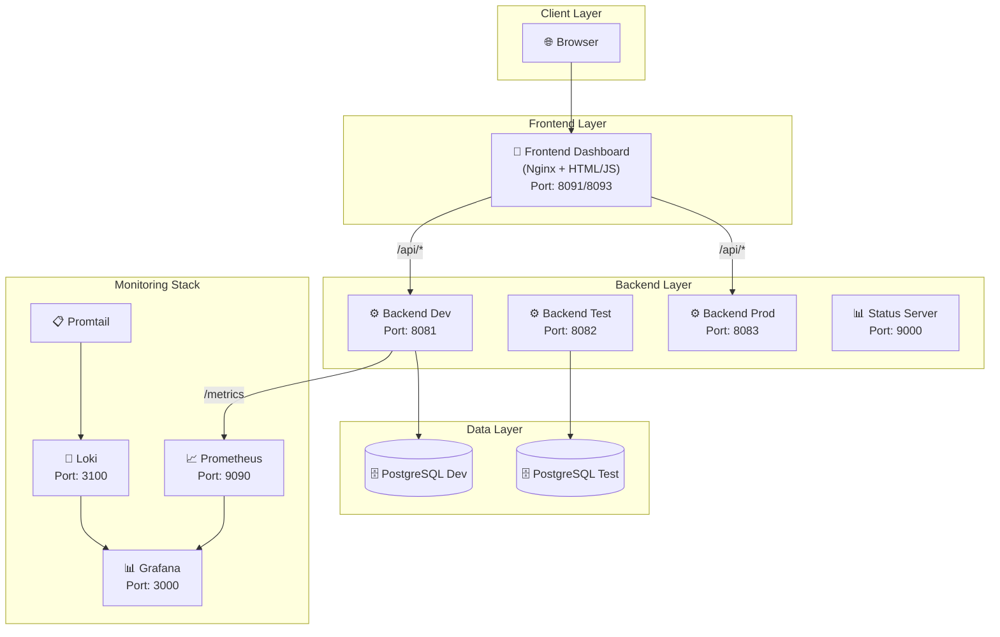
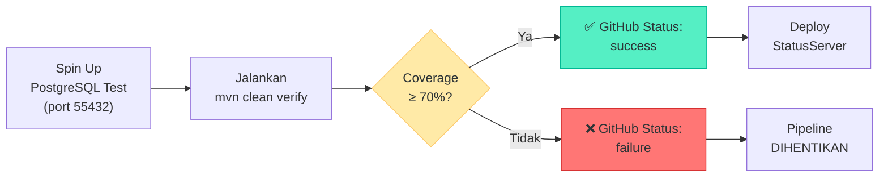
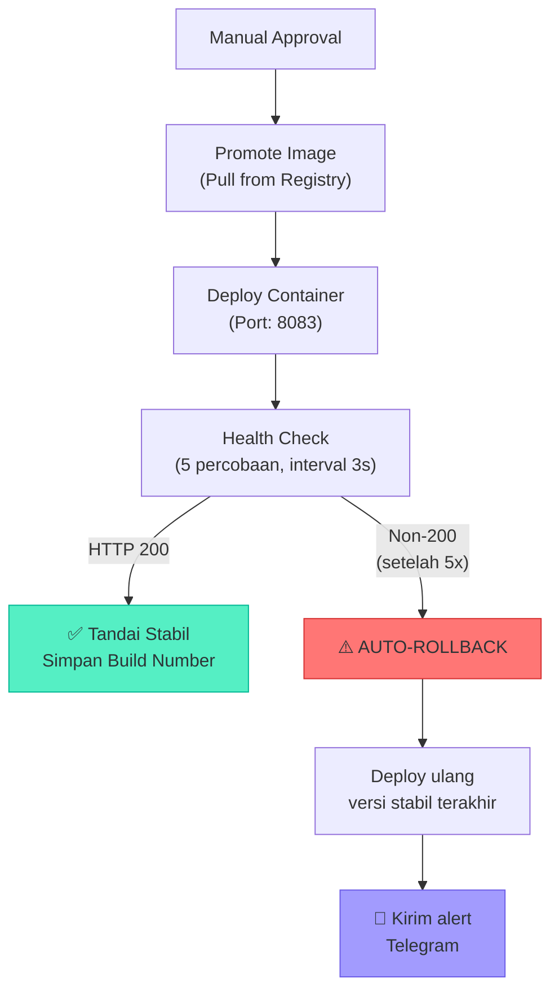

# 🏦 Agen46 — Digital Channel Application

> **CI/CD Pipeline untuk Enterprise Application Deployment**
> Proyek magang yang mengimplementasikan pipeline CI/CD end-to-end pada aplikasi enterprise *Digital Channel* menggunakan Jenkins, Docker, Kubernetes, serta monitoring stack (Prometheus, Grafana, Loki).

---

## 📋 Daftar Isi

- [Overview](#-overview)
- [Arsitektur Sistem](#-arsitektur-sistem)
- [Arsitektur CI/CD Pipeline](#-arsitektur-cicd-pipeline)
- [Tech Stack](#-tech-stack)
- [Struktur Proyek](#-struktur-proyek)
- [Pipeline Stages](#-pipeline-stages)
- [Environment & Branching Strategy](#-environment--branching-strategy)
- [Monitoring & Observability](#-monitoring--observability)
- [API Endpoints](#-api-endpoints)
- [Cara Menjalankan](#-cara-menjalankan)
- [Konfigurasi](#-konfigurasi)

---

## 🔍 Overview

**Agen46 Digital Channel App** adalah aplikasi backend berbasis Java yang menyediakan layanan pembayaran digital (*payment gateway*). Proyek ini berfokus pada pembangunan infrastruktur **CI/CD Pipeline** yang terotomasi penuh — mulai dari *code commit* hingga *production deployment* — dengan mekanisme **quality gate**, **security scanning**, **multi-environment deployment**, **auto-rollback**, serta **real-time monitoring**.

### Fitur Utama

| Fitur | Deskripsi |
|---|---|
| ✅ **Automated Quality Gate** | Unit test (JUnit 5) + code coverage check (JaCoCo, threshold 70%) |
| 🐳 **Containerization** | Packaging aplikasi ke Docker image dengan registry lokal |
| 🔒 **Security Scanning** | Pemindaian CVE menggunakan Trivy pada Docker image |
| 🚀 **Multi-Environment Deploy** | Development → Testing → Production dengan approval gate |
| 🔄 **Auto-Rollback** | Rollback otomatis di Production jika health check gagal |
| 📊 **Real-time Monitoring** | Prometheus metrics + Grafana dashboard + Loki logging |
| 💬 **Telegram Notification** | Notifikasi build sukses/gagal via Telegram Bot |
| 🎨 **Frontend Dashboard** | Dashboard Nginx untuk monitoring kesehatan sistem |
| 📈 **Load Testing** | Pengujian performa menggunakan k6 |
| 🤖 **Infrastructure as Code** | Provisioning otomatis via Ansible playbook |

---

## 🏗 Arsitektur Sistem



---

## 🔁 Arsitektur CI/CD Pipeline

Diagram berikut menggambarkan alur lengkap pipeline CI/CD yang diimplementasikan pada proyek ini:

```mermaid
flowchart LR
    subgraph TRIGGER ["🔔 Trigger"]
        GIT["Git Push /<br/>Poll SCM"]
    end

    subgraph QG ["Fase 0 — Quality Gate"]
        direction TB
        DB_TEMP[("PostgreSQL<br/>Temp (Test)")]
        UNIT["Unit Test<br/>(JUnit 5)"]
        COV["Coverage Check<br/>(JaCoCo ≥ 70%)"]
        GH_STATUS["GitHub<br/>Commit Status"]
        DB_TEMP --> UNIT --> COV --> GH_STATUS
    end

    subgraph BUILD ["Fase 1 — Build & Package"]
        direction TB
        MVN["Maven Package<br/>(Backend JAR)"]
        FE_BUILD["Docker Build<br/>(Frontend Nginx)"]
        DOCKER["Docker Build<br/>(Backend Image)"]
        MVN --> DOCKER
    end

    subgraph SECURITY ["Fase 1D — Security"]
        TRIVY["🔒 Trivy Scan<br/>(HIGH/CRITICAL)"]
    end

    subgraph REGISTRY ["📦 Registry"]
        REG["Docker Registry<br/>localhost:5050"]
    end

    subgraph DEV ["🟥 Development"]
        DEV_DEPLOY["Deploy Container<br/>Port: 8081"]
        DEV_SMOKE["Smoke Test<br/>(Health Check)"]
        DEV_DEPLOY --> DEV_SMOKE
    end

    subgraph TEST ["🟡 Testing / SIT"]
        TEST_APPROVE["⏸️ Manual<br/>Approval"]
        TEST_PROMOTE["Promote Image<br/>(Pull from Registry)"]
        TEST_DEPLOY["Deploy Container<br/>Port: 8082"]
        TEST_SMOKE["Smoke Test<br/>(Health Check)"]
        TEST_APPROVE --> TEST_PROMOTE --> TEST_DEPLOY --> TEST_SMOKE
    end

    subgraph PROD ["🟢 Production"]
        PROD_APPROVE["⏸️ Manual<br/>Approval"]
        PROD_PROMOTE["Promote Image<br/>(Pull from Registry)"]
        PROD_DEPLOY["Deploy Container<br/>Port: 8083"]
        PROD_HEALTH["Health Check<br/>(5 retries)"]
        PROD_STABLE["✅ Mark Stable"]
        PROD_ROLLBACK["🔄 Auto-Rollback<br/>ke versi stabil"]
        PROD_APPROVE --> PROD_PROMOTE --> PROD_DEPLOY --> PROD_HEALTH
        PROD_HEALTH -->|"✅ Sukses"| PROD_STABLE
        PROD_HEALTH -->|"❌ Gagal"| PROD_ROLLBACK
    end

    subgraph NOTIFY ["📬 Notification"]
        TG["🤖 Telegram Bot<br/>Notifikasi"]
        STATUS_SRV["📊 Status Server<br/>Dashboard"]
    end

    subgraph MONITOR ["📊 Monitoring"]
        PROM2["Prometheus"]
        GRAF2["Grafana"]
        LOKI2["Loki + Promtail"]
    end

    GIT --> QG
    QG --> BUILD
    BUILD --> SECURITY
    SECURITY --> REG
    FE_BUILD --> REG
    DOCKER --> REG
    REG --> DEV
    REG --> TEST
    REG --> PROD
    DEV_SMOKE --> NOTIFY
    TEST_SMOKE --> NOTIFY
    PROD_STABLE --> NOTIFY
    PROD_ROLLBACK --> NOTIFY
    DEV_DEPLOY --> MONITOR
    TEST_DEPLOY --> MONITOR

    style TRIGGER fill:#ffeaa7,stroke:#fdcb6e,color:#2d3436
    style QG fill:#dfe6e9,stroke:#b2bec3,color:#2d3436
    style BUILD fill:#dfe6e9,stroke:#b2bec3,color:#2d3436
    style SECURITY fill:#fab1a0,stroke:#e17055,color:#2d3436
    style REGISTRY fill:#81ecec,stroke:#00cec9,color:#2d3436
    style DEV fill:#ff7675,stroke:#d63031,color:#2d3436
    style TEST fill:#ffeaa7,stroke:#fdcb6e,color:#2d3436
    style PROD fill:#55efc4,stroke:#00b894,color:#2d3436
    style NOTIFY fill:#a29bfe,stroke:#6c5ce7,color:#2d3436
    style MONITOR fill:#74b9ff,stroke:#0984e3,color:#2d3436
```



### Alur Pipeline Secara Ringkas

```
┌─────────────┐    ┌─────────────────┐    ┌──────────────┐    ┌────────────┐
│  Git Push    │───▶│  Quality Gate   │───▶│  Build &     │───▶│  Security  │
│  (pollSCM)  │    │  (Test+Coverage) │    │  Package     │    │  Scan      │
└─────────────┘    └─────────────────┘    └──────────────┘    └─────┬──────┘
                                                                     │
                   ┌──────────────────────────────────────────────────┘
                   ▼
            ┌──────────────┐    ┌──────────────┐    ┌──────────────────┐
            │  Deploy to   │───▶│  Deploy to   │───▶│  Deploy to       │
            │  Development │    │  Testing     │    │  Production      │
            │  (auto)      │    │  (approval)  │    │  (approval +     │
            └──────────────┘    └──────────────┘    │   auto-rollback) │
                                                    └──────────────────┘
```

---

## 🛠 Tech Stack

### Application

| Komponen | Teknologi | Versi |
|---|---|---|
| Backend | Java (OpenJDK) | 11 (compile) / 21 (runtime) |
| HTTP Server | `com.sun.net.httpserver` | Built-in JDK |
| Database | PostgreSQL | 16 Alpine |
| Build Tool | Apache Maven | 3.9.9 |
| Frontend | HTML/CSS/JS + Nginx | Alpine |

### CI/CD & DevOps

| Komponen | Teknologi | Fungsi |
|---|---|---|
| CI/CD Engine | Jenkins | Orkestrasi pipeline |
| Containerization | Docker | Packaging & deployment |
| Container Registry | Docker Registry | Penyimpanan image (localhost:5050) |
| Container Orchestration | Kubernetes | Deployment (manifest tersedia) |
| Security Scan | Trivy | Pemindaian CVE pada image |
| Unit Testing | JUnit 5 | Pengujian unit |
| Code Coverage | JaCoCo | Analisis coverage (threshold 70%) |
| IaC | Ansible | Provisioning infrastruktur |
| Load Testing | k6 (Grafana) | Pengujian performa |

### Monitoring & Observability

| Komponen | Teknologi | Port |
|---|---|---|
| Metrics Collection | Prometheus | 9090 |
| Visualization | Grafana | 3000 |
| Log Aggregation | Loki | 3100 |
| Log Shipping | Promtail | — |
| Pipeline Dashboard | StatusServer (Custom) | 9000 |

### Notification

| Komponen | Teknologi |
|---|---|
| Build Notification | Telegram Bot API |
| Commit Status | GitHub Status API |

---

## 📂 Struktur Proyek

```
Project_Magang_Linux/
├── 📄 Jenkinsfile                  # Definisi pipeline CI/CD (382 baris)
├── 🐳 Dockerfile                   # Docker image backend (JRE 21 Alpine)
├── 🐳 Dockerfile.status            # Docker image StatusServer
├── 📦 pom.xml                      # Maven build config + JaCoCo + Shade plugin
├── 📝 app.log                      # Application log
│
├── 📁 src/
│   ├── 📁 main/java/com/channel/digital/
│   │   ├── ☕ App.java              # Backend utama (HTTP server, REST API, Prometheus metrics)
│   │   └── ☕ StatusServer.java     # Dashboard real-time status pipeline
│   └── 📁 test/java/com/channel/digital/
│       ├── ☕ AppTest.java           # Unit test untuk App
│       └── ☕ StatusServerTest.java  # Unit test untuk StatusServer
│
├── 📁 frontend/
│   ├── 🐳 Dockerfile               # Docker image frontend (Nginx Alpine)
│   ├── 📄 index.html               # Dashboard UI frontend
│   └── ⚙️ nginx.conf.template      # Nginx reverse proxy config
│
├── 📁 k8s/
│   └── ⚙️ backend-deployment.yaml  # Kubernetes Deployment + Service (NodePort)
│
├── 📁 monitoring/
│   ├── 🐳 docker-compose.yml       # Stack: Prometheus + Grafana + Loki + Promtail
│   ├── ⚙️ prometheus.yml           # Scrape config untuk backend metrics
│   ├── ⚙️ loki-config.yml          # Konfigurasi Loki
│   ├── ⚙️ promtail-config.yml      # Konfigurasi Promtail
│   ├── 🤖 setup-agen46.yml         # Ansible playbook (provisioning infra)
│   ├── 📋 inventory.ini            # Ansible inventory
│   └── 📈 load-test.js             # k6 load testing script
│
└── 📁 digital-channel-app/         # Artefak tambahan
```

---

## 🔄 Pipeline Stages

Berikut adalah tahapan-tahapan pipeline secara detail beserta mekanismenya:

### Fase 0 — Test & Quality Gate



- Membuat **database PostgreSQL sementara** via Docker untuk isolasi test
- Menjalankan **unit test** menggunakan JUnit 5
- Mengecek **code coverage** dengan JaCoCo (minimum threshold: **70%**)
- Melaporkan status ke **GitHub Commit Status API** (pending → success/failure)
- Jika gagal, pipeline langsung **dihentikan**

### Fase 1A/1B — Build & Package (Parallel)

- **1A — Backend Build**: `mvn package -DskipTests` → menghasilkan uber-JAR via Maven Shade plugin
- **1B — Frontend Build**: `docker build` pada folder `frontend/` → image Nginx + static assets
- Kedua proses berjalan **paralel** untuk efisiensi waktu

### Fase 1C — Containerization

- Membungkus JAR hasil build ke **Docker image** (`eclipse-temurin:21-jre-alpine`)
- Push image ke **Docker Registry** lokal (`localhost:5050`)
- Tagging image dengan format: `{branch}-{buildNumber}` dan `{branch}-latest`

### Fase 1D — Security Scan

- Memindai Docker image menggunakan **Trivy**
- Fokus pada kerentanan severitas **HIGH** dan **CRITICAL**
- Menghasilkan laporan dalam format tabel

### Fase 2 — Deploy to Development (Otomatis)

- Deploy otomatis pada branch `developmentlinux`
- Container dijalankan pada **port 8081** (backend) dan **port 8091** (frontend)
- **Smoke test** otomatis mengecek endpoint `/api/v1/payments/health`
- Update **StatusServer dashboard**

### Fase 3 — Deploy to Testing (Manual Approval)

- Memerlukan **manual approval** sebelum deploy
- Image di-**promote** (pull) dari registry — **tidak di-build ulang**
- Container dijalankan pada **port 8082**
- Smoke test otomatis setelah deploy

### Fase 4 — Deploy to Production (Manual Approval + Auto-Rollback)



- Memerlukan **manual approval** sebelum deploy
- Health check dengan **5 kali percobaan** (interval 3 detik)
- Jika sukses: build number disimpan sebagai **versi stabil terakhir**
- Jika gagal: **auto-rollback** ke versi stabil terakhir + notifikasi Telegram
- Mendukung juga **manual rollback** via parameter `ROLLBACK_VERSION`

---

## 🌿 Environment & Branching Strategy

```mermaid
gitgraph
    commit id: "feature"
    branch developmentlinux
    checkout developmentlinux
    commit id: "dev-1"
    commit id: "dev-2"
    branch testing
    checkout testing
    commit id: "promote-to-test"
    branch production
    checkout production
    commit id: "promote-to-prod"
```

| Branch | Environment | Port Backend | Port Frontend | Deploy |
|---|---|---|---|---|
| `developmentlinux` | Development | 8081 | 8091 | ✅ Otomatis |
| `testing` | Testing / SIT | 8082 | 8091 | ⏸️ Manual Approval |
| `production` | Production | 8083 | 8093 | ⏸️ Manual Approval + Auto-Rollback |

### Prinsip Immutable Artifact

> 🔑 **Image di-build hanya SATU KALI di branch `developmentlinux`**, lalu di-**promote** (pull dari registry) ke Testing dan Production — memastikan artefak yang identik dikirim ke semua environment.

---

## 📊 Monitoring & Observability

### Metrics (Prometheus)

Aplikasi meng-expose endpoint `/metrics` dalam format Prometheus:

| Metric | Tipe | Deskripsi |
|---|---|---|
| `agen46_uptime_seconds` | Counter | Uptime aplikasi dalam detik |
| `agen46_requests_total` | Counter | Total request per endpoint (`root`, `health`, `test`) |
| `agen46_last_response_time_ms` | Gauge | Response time terakhir per endpoint (ms) |
| `agen46_database_up` | Gauge | Status koneksi database (1=UP, 0=DOWN) |

### Logging (Loki + Promtail)

- **Promtail** mengumpulkan log dari semua container Docker
- **Loki** sebagai backend log aggregation
- Divisualisasikan di **Grafana**

### Load Testing (k6)

Skenario load test yang digunakan:

```
0s–30s    → Ramp up ke 10 virtual users
30s–1m30s → Tahan 10 VUs
1m30s–2m  → Ramp up ke 50 VUs
2m–3m     → Tahan 50 VUs
3m–3m30s  → Cooldown ke 0
```

Threshold:
- 95% request harus **di bawah 1 detik** (p95 < 1000ms)
- Error rate harus **di bawah 5%**

### Pipeline Status Dashboard

Aplikasi `StatusServer` (port 9000) menampilkan status deployment real-time dengan warna:

| Tahap | Warna |
|---|---|
| Development | 🟥 Merah (`#e74c3c`) |
| Testing | 🟡 Kuning (`#f1c40f`) |
| Production | 🟢 Hijau (`#2ecc71`) |
| Production Rollback | 🟠 Oranye (`#e67e22`) |
| Auto-Rollback | 🔵 Biru (`#3498db`) |

---

## 🌐 API Endpoints

| Endpoint | Method | Deskripsi |
|---|---|---|
| `/` | GET | Landing page backend (HTML, auto-refresh) |
| `/api/v1/payments/health` | GET | Health check (status + environment + DB) |
| `/api/v1/payments/test` | GET | Insert test data ke PostgreSQL |
| `/metrics` | GET | Prometheus metrics (text/plain) |
| `/photo` | GET | Gambar dinamis (dari build artifact) |

### Contoh Response — Health Check

```json
{
  "status": "UP",
  "environment": "production",
  "database": "UP"
}
```

---

## 🚀 Cara Menjalankan

### Prasyarat

- **Java** 11+ (compile) / 21 (runtime)
- **Maven** 3.9.9
- **Docker** & Docker Compose
- **Jenkins** (dengan plugin: Pipeline, Git, JaCoCo, JUnit, Credentials)
- **PostgreSQL** 16

### 1. Clone Repository

```bash
git clone https://github.com/jordanvieno/Project-Magang.git
cd Project_Magang_Linux
```

### 2. Build Lokal (Tanpa Docker)

```bash
mvn clean verify      # Build + test + coverage check
java -jar target/digital-channel-app-1.0-SNAPSHOT.jar
```

### 3. Build & Run dengan Docker

```bash
# Build backend image
mvn package -DskipTests
docker build -t agen46-backend:latest .

# Build frontend image
cd frontend
docker build -t agen46-frontend:latest .

# Run
docker network create agen46-net
docker run -d --name agen46-dev --network agen46-net -p 8081:8080 agen46-backend:latest
docker run -d --name agen46-frontend-dev --network agen46-net -p 8091:80 agen46-frontend:latest
```

### 4. Jalankan Monitoring Stack

```bash
cd monitoring
docker-compose up -d
```

Akses:
- Prometheus: http://localhost:9090
- Grafana: http://localhost:3000 (admin / agen46admin)

### 5. Provisioning dengan Ansible

```bash
cd monitoring
ansible-playbook -i inventory.ini setup-agen46.yml
```

### 6. Jalankan Load Test

```bash
k6 run monitoring/load-test.js
```

---

## ⚙️ Konfigurasi

### Environment Variables

| Variable | Default | Deskripsi |
|---|---|---|
| `APP_ENV` | `unknown` | Nama environment (development/testing/production) |
| `PORT` | `8080` | Port HTTP server |
| `BUILD_NUMBER` | `N/A` | Nomor build dari Jenkins |
| `DB_HOST` | `localhost` | Host database PostgreSQL |
| `DB_PORT` | `5432` | Port database |
| `DB_NAME` | `agen46_dev` | Nama database |
| `DB_USER` | `agen46` | Username database |
| `DB_PASSWORD` | `agen46pass` | Password database |
| `BACKEND_HOST` | `agen46-dev` | Host backend (untuk Nginx proxy) |

### Jenkins Credentials

| Credential ID | Tipe | Fungsi |
|---|---|---|
| `github-status-token` | Secret Text | Token GitHub untuk commit status |
| `agen46-db-test-credentials` | Username/Password | Kredensial DB test |
| `agen46-db-dev-credentials` | Username/Password | Kredensial DB development |
| `Token_Bot_Telegram` | Secret Text | Token Telegram Bot |
| `Telegram-Chat-ID` | Secret Text | Chat ID Telegram |

### Jenkins Parameters

| Parameter | Tipe | Opsi | Deskripsi |
|---|---|---|---|
| `DEPLOY_ACTION` | Choice | `Release` / `Rollback` | Aksi deployment |
| `ROLLBACK_VERSION` | String | (nomor build) | Target versi rollback |

---

## 📜 Lisensi

Proyek ini dikembangkan sebagai bagian dari program magang di [IPB University](https://ipb.ac.id).

---

<p align="center">
  <b>Agen46 Digital Channel App</b><br/>
  Built with ☕ Java • 🐳 Docker • 🔧 Jenkins • 📊 Prometheus & Grafana
</p>
