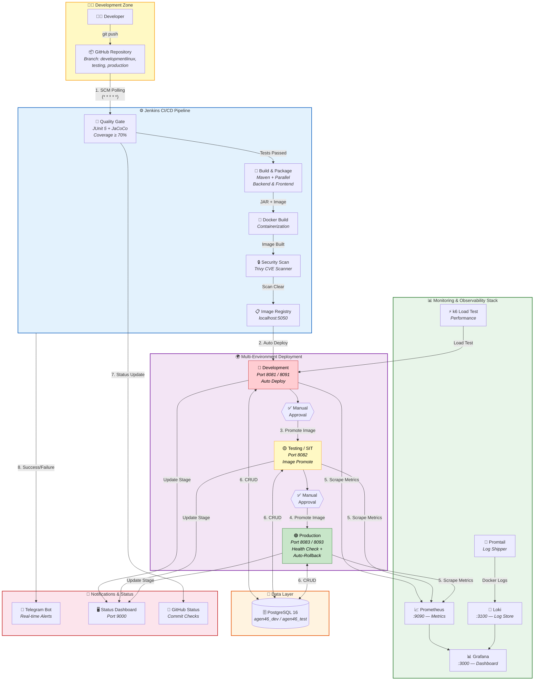
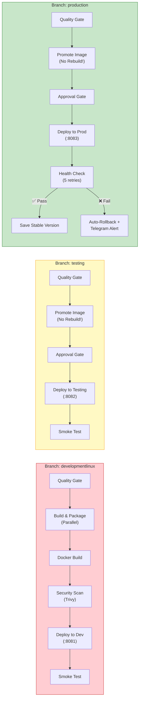
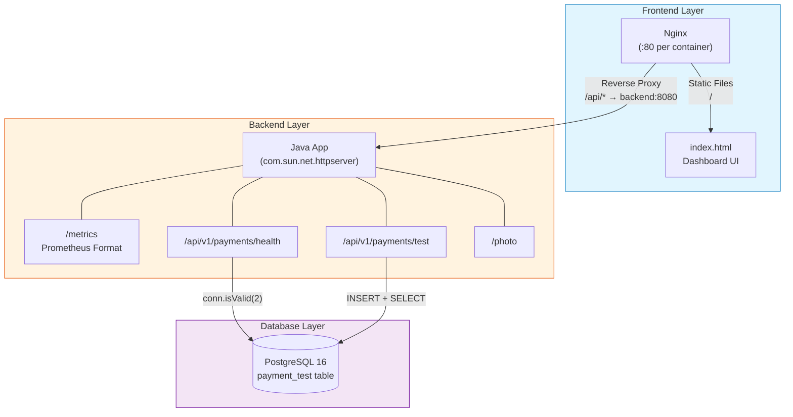
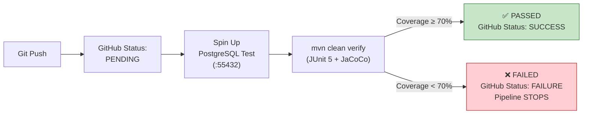
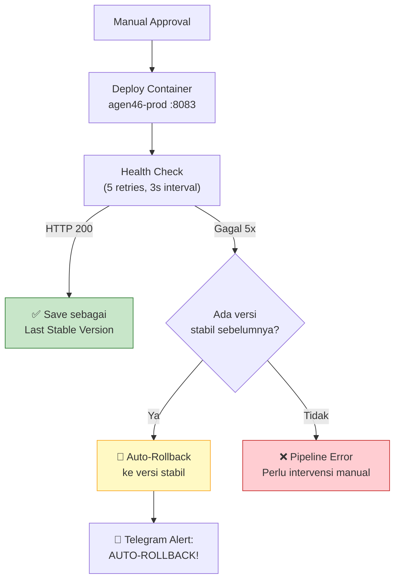
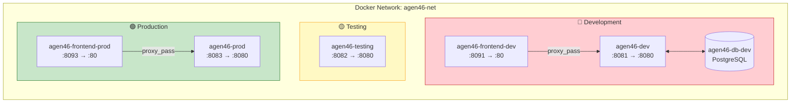
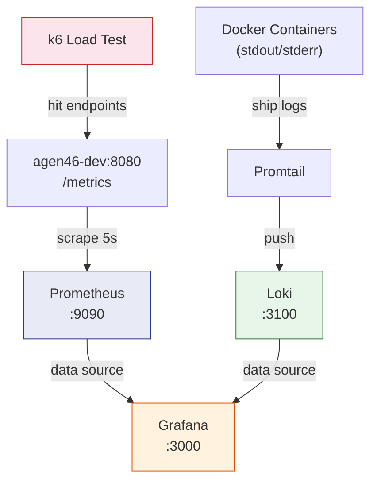

<](https://www.jenkins.io/)
[](https://www.docker.com/)
[](https://openjdk.org/)
[](https://www.postgresql.org/)
[](https://grafana.com/)
[](https://nginx.org/)

---

*Proyek magang — Implementasi CI/CD pipeline enterprise-grade dengan Jenkins, Docker, dan monitoring stack lengkap untuk deployment otomatis ke tiga environment (Development, Testing, Production) dengan quality gate, security scanning, dan auto-rollback.*

</div>

---

## 📋 Daftar Isi

- [Ringkasan Proyek](#-ringkasan-proyek)
- [Arsitektur Sistem](#-arsitektur-sistem)
- [Tech Stack](#-tech-stack)
- [Struktur Proyek](#-struktur-proyek)
- [Alur Pipeline CI/CD](#-alur-pipeline-cicd)
- [Komponen Aplikasi](#-komponen-aplikasi)
- [Environment Deployment](#-environment-deployment)
- [Monitoring & Observability](#-monitoring--observability)
- [Security](#-security)
- [Notifikasi & Status Dashboard](#-notifikasi--status-dashboard)
- [Infrastructure as Code](#-infrastructure-as-code)
- [Cara Menjalankan](#-cara-menjalankan)
- [API Endpoints](#-api-endpoints)

---

## 🎯 Ringkasan Proyek

**Agen46** adalah sistem CI/CD pipeline lengkap yang dirancang untuk deployment aplikasi enterprise secara otomatis. Proyek ini mengimplementasikan arsitektur **CI/CD Level 2** (Pipeline Automation) dengan fitur-fitur:

| Fitur | Deskripsi |
|-------|-----------|
| 🔄 **Automated Pipeline** | SCM polling setiap menit, build & deploy otomatis |
| 🧪 **Quality Gate** | Unit test (JUnit 5) + code coverage (JaCoCo ≥ 70%) |
| 🐳 **Containerization** | Docker multi-stage build dengan image registry lokal |
| 🔒 **Security Scanning** | Pemindaian CVE menggunakan Trivy |
| 🌍 **Multi-Environment** | Development → Testing → Production dengan approval gate |
| 📊 **Full Monitoring** | Prometheus + Grafana + Loki + Promtail |
| 🔁 **Auto-Rollback** | Rollback otomatis jika health check gagal di Production |
| 📱 **Notifikasi Real-time** | Telegram Bot untuk update status pipeline |
| 🏗️ **IaC** | Ansible playbook untuk provisioning infrastructure |

---

## 🏗 Arsitektur Sistem

### Diagram Arsitektur Lengkap — CI/CD Pipeline Automation



### Diagram Alur Pipeline per Branch



### Diagram Interaksi Komponen



---

## 🛠 Tech Stack

### Application

| Layer | Teknologi | Versi | Keterangan |
|-------|-----------|-------|------------|
| **Backend** | Java (OpenJDK) | 11 | `com.sun.net.httpserver.HttpServer` — lightweight HTTP server |
| **Frontend** | HTML + CSS + JS | - | Single-page dashboard dengan fetch API |
| **Web Server** | Nginx | Alpine | Reverse proxy + static file server |
| **Database** | PostgreSQL | 16-alpine | RDBMS untuk data persistence |
| **Build Tool** | Apache Maven | 3.9.9 | Compile, test, package (`shade-plugin` untuk fat JAR) |
| **Runtime** | Eclipse Temurin JRE | 21-alpine | Lightweight container runtime |

### CI/CD & DevOps

| Kategori | Teknologi | Keterangan |
|----------|-----------|------------|
| **CI/CD Engine** | Jenkins | Declarative pipeline, multi-branch |
| **SCM** | GitHub | Polling setiap menit (`* * * * *`) |
| **Containerization** | Docker | Multi-image build (backend + frontend) |
| **Image Registry** | Docker Registry | `localhost:5050` — private registry |
| **Security Scanner** | Trivy | Scan CVE severity HIGH & CRITICAL |
| **Testing** | JUnit 5 | Unit test framework |
| **Code Coverage** | JaCoCo | Threshold minimum 70% line coverage |
| **IaC** | Ansible | Playbook untuk provisioning server |
| **Load Testing** | k6 (Grafana) | Performance & stress testing |

### Monitoring & Observability

| Komponen | Port | Fungsi |
|----------|------|--------|
| **Prometheus** | `:9090` | Metrics collection & time-series DB |
| **Grafana** | `:3000` | Visualization & dashboard |
| **Loki** | `:3100` | Log aggregation (like Prometheus, but for logs) |
| **Promtail** | - | Log shipping agent (Docker container logs) |

### Notifikasi

| Komponen | Keterangan |
|----------|------------|
| **Telegram Bot** | Notifikasi sukses/gagal/auto-rollback pipeline |
| **GitHub Status API** | Commit status checks (pending → success/failure) |
| **Status Dashboard** | Web dashboard real-time di port `:9000` |

---

## 📁 Struktur Proyek

```
Project_Magang_Linux/
├── 📄 Jenkinsfile                        # Pipeline utama (382 baris, multi-branch)
├── 🐳 Dockerfile                         # Backend Docker image (Temurin 21 JRE)
├── 🐳 Dockerfile.status                  # Status Dashboard Docker image
├── 📦 pom.xml                            # Maven config (JUnit5, JaCoCo, Shade plugin)
│
├── 📂 src/
│   ├── 📂 main/java/com/channel/digital/
│   │   ├── ☕ App.java                   # Main backend (REST API, metrics, DB ops)
│   │   └── ☕ StatusServer.java          # Pipeline status dashboard server (:9000)
│   ├── 📂 main/resources/static/
│   │   └── 🖼️ foto.jpg                  # Dynamic photo (generated per commit)
│   └── 📂 test/java/com/channel/digital/
│       ├── 🧪 AppTest.java              # 10 unit tests for App
│       └── 🧪 StatusServerTest.java     # Tests for StatusServer
│
├── 📂 frontend/
│   ├── 📄 index.html                     # Dashboard UI (health check + DB test)
│   ├── 🐳 Dockerfile                     # Nginx-based frontend image
│   └── ⚙️ nginx.conf.template           # Reverse proxy config (→ backend:8080)
│
├── 📂 k8s/
│   └── 📄 backend-deployment.yaml        # K8s Deployment + Service (NodePort 30080)
│
├── 📂 monitoring/
│   ├── 🐳 docker-compose.yml            # Full monitoring stack
│   ├── ⚙️ prometheus.yml                # Scrape config (agen46-dev:8080)
│   ├── ⚙️ loki-config.yml               # Loki storage config
│   ├── ⚙️ promtail-config.yml           # Promtail → Loki shipping config
│   ├── 🤖 setup-agen46.yml              # Ansible playbook (IaC)
│   ├── 📋 inventory.ini                  # Ansible inventory
│   └── ⚡ load-test.js                   # k6 load test script (10→50 VUs)
│
├── 📂 .github/modernize/                # GitHub Modernize configs
└── 📄 Research Document CICD Pipeline... # Research documentation (.docx)
```

---

## 🔄 Alur Pipeline CI/CD

Pipeline dijalankan berdasarkan **branch** yang aktif. Setiap branch memiliki behavior yang berbeda:

### Stage 0 — Quality Gate (Semua Branch)



- Spin up temporary PostgreSQL container di port `55432`
- Jalankan `mvn clean verify` (compile + test + coverage check)
- JaCoCo threshold: **minimum 70% line coverage**
- Update GitHub commit status via API

### Stage 1 — Build & Package (Branch `developmentlinux`)

| Sub-stage | Proses |
|-----------|--------|
| **1A: Backend Build** | `mvn package -DskipTests` → fat JAR via shade plugin |
| **1B: Frontend Build** | Docker build Nginx image + push ke registry |
| **1C: Containerization** | Docker build backend image + push ke registry |
| **1D: Security Scan** | Trivy scan `HIGH,CRITICAL` CVE |

> **💡 Catatan:** Stage 1A dan 1B berjalan **paralel** untuk mempercepat pipeline.

### Stage 2 — Deploy to Development (Branch `developmentlinux`)

- Auto-deploy tanpa approval
- Container: `agen46-dev` di port `:8081`
- Frontend: `agen46-frontend-dev` di port `:8091`
- Smoke test: verifikasi `/api/v1/payments/health` return HTTP 200
- Update Status Dashboard

### Stage 3 — Deploy to Testing (Branch `testing`)

- **Manual approval** required
- Image di-**promote** (pull dari registry, tanpa build ulang!)
- Container: `agen46-testing` di port `:8082`
- Smoke test setelah deploy

### Stage 4 — Deploy to Production (Branch `production`)



- **Manual approval** required
- Health check: 5 percobaan, interval 3 detik
- Jika sukses: simpan build number sebagai "last stable"
- Jika gagal: **auto-rollback** ke versi stabil terakhir + kirim alert Telegram
- Support **manual rollback** via parameter `ROLLBACK_VERSION`

---

## ⚙️ Komponen Aplikasi

### Backend — `App.java`

Main entry point yang menjalankan lightweight HTTP server (`com.sun.net.httpserver`).

| Endpoint | Method | Deskripsi |
|----------|--------|-----------|
| `/` | GET | Landing page HTML dengan info environment & build number |
| `/api/v1/payments/health` | GET | Health check — status aplikasi + koneksi database |
| `/api/v1/payments/test` | GET | Test insert ke database + return 5 row terakhir |
| `/photo` | GET | Serve gambar dinamis (di-generate per commit dari picsum.photos) |
| `/metrics` | GET | Prometheus metrics (uptime, request count, response time, DB status) |

**Custom Metrics yang di-expose:**

```
agen46_uptime_seconds          — Waktu aplikasi sudah berjalan
agen46_requests_total          — Jumlah request per endpoint (root, health, test)
agen46_last_response_time_ms   — Response time terakhir per endpoint
agen46_database_up             — Status koneksi database (1=up, 0=down)
```

### Status Dashboard — `StatusServer.java`

Dashboard real-time yang menampilkan tahap terakhir pipeline, berjalan di port `:9000`.

| Endpoint | Method | Deskripsi |
|----------|--------|-----------|
| `/` | GET | HTML dashboard — auto-refresh setiap 2 detik |
| `/update?stage=X&build=Y` | GET | Update stage & build number (dipanggil dari Jenkinsfile) |

**Warna per Stage:**

| Stage | Warna | Hex |
|-------|-------|-----|
| Development | 🔴 Merah | `#e74c3c` |
| Testing | 🟡 Kuning | `#f1c40f` |
| Production | 🟢 Hijau | `#2ecc71` |
| Production Rollback | 🟠 Oranye | `#e67e22` |
| Auto-Rollback | 🔵 Biru | `#3498db` |
| Idle/Unknown | ⚪ Abu-abu | `#95a5a6` |

### Frontend — `index.html`

Dashboard web yang terhubung ke backend via Nginx reverse proxy.

**Fitur:**
- **Cek Kesehatan Sistem** — memanggil `/api/v1/payments/health`
- **Test Insert Database** — memanggil `/api/v1/payments/test`
- Auto-check health saat halaman dibuka
- Color-coded status: hijau (UP), merah (DOWN)

---

## 🌍 Environment Deployment



| Environment | Backend Port | Frontend Port | Deploy Method | Approval |
|-------------|-------------|---------------|---------------|----------|
| **Development** | `:8081` | `:8091` | Auto deploy | ❌ Tidak perlu |
| **Testing/SIT** | `:8082` | — | Image promote | ✅ Manual |
| **Production** | `:8083` | `:8093` | Image promote | ✅ Manual |

**Prinsip Penting:** Image di-build **hanya sekali** di branch `developmentlinux`. Branch `testing` dan `production` hanya melakukan **promote** (pull image yang sama dari registry), memastikan konsistensi artefak di semua environment.

---

## 📊 Monitoring & Observability

### Stack Overview



| Komponen | Image | Volume | Network |
|----------|-------|--------|---------|
| **Prometheus** | `prom/prometheus:latest` | `agen46-prometheus-data` | `agen46-net` |
| **Grafana** | `grafana/grafana:latest` | `agen46-grafana-data` | `agen46-net` |
| **Loki** | `grafana/loki:2.9.0` | `agen46-loki-data` | `agen46-net` |
| **Promtail** | `grafana/promtail:2.9.0` | Docker socket mount | `agen46-net` |

### Load Testing (k6)

Script `load-test.js` mensimulasikan traffic realistis:

| Phase | Durasi | Virtual Users | Tujuan |
|-------|--------|---------------|--------|
| Ramp-up | 30s | 0 → 10 | Gradual warm-up |
| Sustain | 1m | 10 | Baseline performance |
| Spike | 30s | 10 → 50 | Stress test |
| Peak | 1m | 50 | Peak load |
| Cooldown | 30s | 50 → 0 | Graceful decline |

**Thresholds:**
- ✅ 95th percentile response time < 1000ms
- ✅ Error rate < 5%

---

## 🔒 Security

### Trivy Security Scanning

- Dipicu otomatis setelah Docker build
- Scan severity: **HIGH** dan **CRITICAL**
- Exit code `0` (non-blocking) — hasil ditampilkan dalam log Jenkins
- Cache Trivy disimpan di Docker volume `trivy-cache`

### Credential Management

Semua credential dikelola via **Jenkins Credentials Store**:

| Credential ID | Tipe | Kegunaan |
|--------------|------|----------|
| `agen46-db-dev-credentials` | Username/Password | Koneksi DB development |
| `agen46-db-test-credentials` | Username/Password | Koneksi DB testing (temporary) |
| `github-status-token` | Secret Text | GitHub API untuk commit status |
| `Token_Bot_Telegram` | Secret Text | Telegram Bot token |
| `Telegram-Chat-ID` | Secret Text | Telegram chat/group ID |

---

## 📢 Notifikasi & Status Dashboard

### Telegram Bot

| Event | Pesan |
|-------|-------|
| Pipeline Sukses | `✅ Pipeline SUKSES — branch: X, build: #Y` |
| Pipeline Gagal | `❌ Pipeline GAGAL — branch: X, build: #Y` |
| Auto-Rollback | `⚠️ AUTO-ROLLBACK terjadi di Production! Build #X gagal health check, otomatis kembali ke build stabil #Y` |

### Status Dashboard (Port 9000)

Server Java ringan yang menampilkan status pipeline secara real-time:
- Auto-refresh setiap 2 detik
- Background color berubah sesuai stage aktif
- Dijalankan sebagai **systemd service** (`agen46-status`)
- Endpoint `/update` dipanggil oleh Jenkinsfile setiap kali deploy berhasil

### GitHub Commit Status

Pipeline melaporkan status quality gate ke GitHub commit:
- **Pending** → saat test dimulai
- **Success** → test lolos & coverage memenuhi threshold
- **Failure** → test gagal atau coverage di bawah threshold

---

## 🤖 Infrastructure as Code

### Ansible Playbook (`setup-agen46.yml`)

Playbook Ansible untuk provisioning server CI/CD secara otomatis:

```yaml
Tasks:
  1. Buat Docker network `agen46-net`
  2. Buat folder `/opt/agen46` untuk StatusServer
  3. Deploy script wrapper `deploy-statusserver.sh`
  4. Buat systemd service `agen46-status`
  5. Reload systemd & enable service
  6. Konfigurasi sudoers untuk Jenkins user
  7. Jalankan docker-compose monitoring stack
```

### Kubernetes (Experimental)

File `k8s/backend-deployment.yaml` menyediakan:
- **Deployment** dengan 2 replicas + RollingUpdate strategy
- **Readiness Probe** pada `/api/v1/payments/health`
- **Service** tipe NodePort di port `30080`

---

## 🚀 Cara Menjalankan

### Prerequisites

- Docker & Docker Compose
- Jenkins dengan Maven 3.9.9
- PostgreSQL 16
- Java 21 (runtime) / Java 11 (compile)

### 1. Jalankan Monitoring Stack

```bash
cd monitoring
docker network create agen46-net
docker-compose up -d
```

### 2. Jalankan Infrastructure Setup (Ansible)

```bash
cd monitoring
ansible-playbook -i inventory.ini setup-agen46.yml
```

### 3. Pipeline (Jenkins)

Pipeline akan otomatis dijalankan setiap ada perubahan di repository (SCM polling setiap menit).

**Parameter Pipeline:**

| Parameter | Pilihan | Keterangan |
|-----------|---------|------------|
| `DEPLOY_ACTION` | `Release` / `Rollback` | Release = deploy terbaru, Rollback = kembali ke versi lama |
| `ROLLBACK_VERSION` | Build number | Nomor build yang ingin di-rollback (hanya untuk Production) |

### 4. Load Test

```bash
docker run --rm -i --network agen46-net \
  grafana/k6 run - < monitoring/load-test.js
```

---

## 📡 API Endpoints

### Backend API (Port 8080)

```
GET  /                          → Landing page HTML
GET  /api/v1/payments/health    → {"status":"UP","environment":"...","database":"UP"}
GET  /api/v1/payments/test      → {"result":"success","rows":[...]}
GET  /photo                     → Image JPEG (dynamic per commit)
GET  /metrics                   → Prometheus text format
```

### Status Dashboard API (Port 9000)

```
GET  /                          → Status dashboard HTML
GET  /update?stage=X&build=Y    → Update pipeline stage
```

---

## 📄 Dokumentasi Terkait

- `Research Document CICD Pipeline for Enterprise Application Deployment.docx` — Dokumen riset lengkap tentang implementasi CI/CD pipeline

---

<div align="center">

**Dikembangkan sebagai proyek magang di IPB University**

*CI/CD Pipeline for Enterprise Application Deployment*

---

Made with ❤️ by **Agen46 Team**

</div>
]]>
